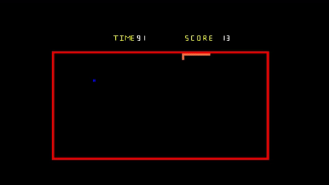

# Snack-Game

一進入遊戲後，使用wasd操作，一開始按wasd任意按鍵即可遊戲。

遊戲開始後，會開始計時，一但撞到牆壁就會-20秒並自動轉向，遊戲時間結束前須盡量得分，
另外每吃一個藍色方塊蛇的身體會增長1格並+5秒。

滑鼠右鍵點開後可以調整速度，速度有四種模式:Slow , Mesium , Fast , Crazy，
此外還有無敵模式，滑鼠右鍵點開後按下hack撞到牆壁時就不會因此耗損時間，
如果要取消在按一次hack 即可。

當time<=0時，程式停止運作，此時score即為最終得分。

